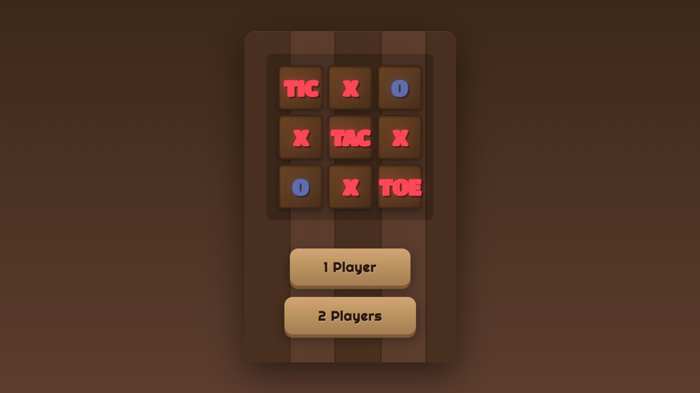
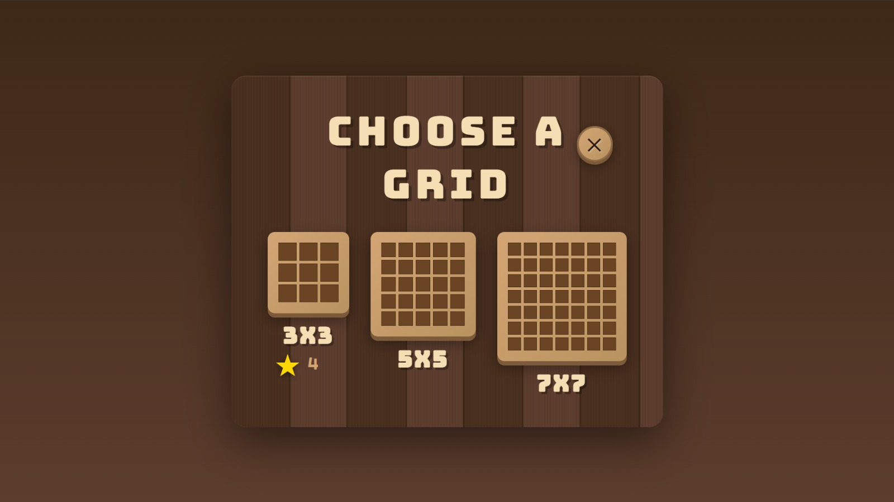
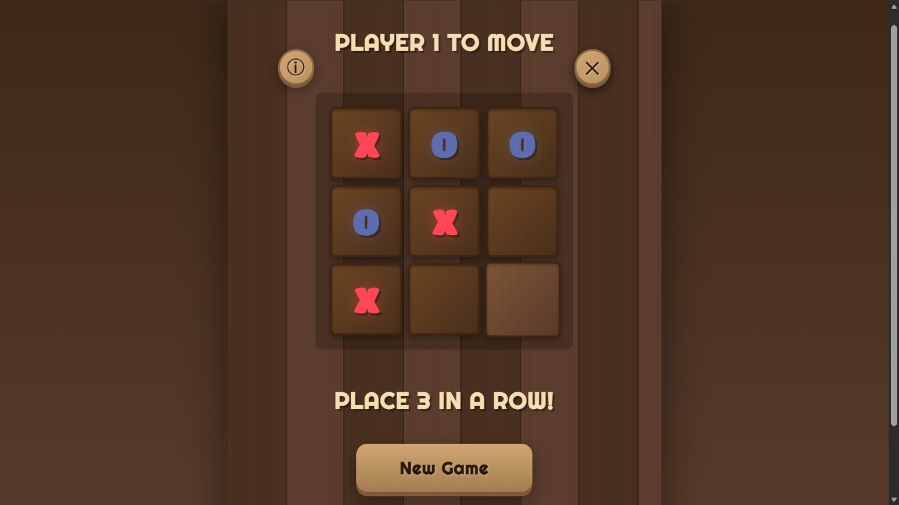
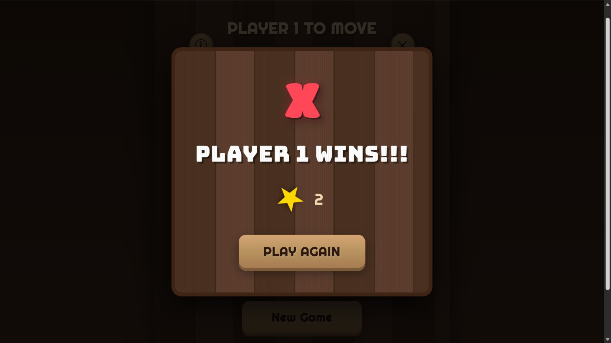

# 🎮 Tic Tac Toe Game

A beautiful, feature-rich Tic Tac Toe game with a stunning wooden theme, multiple grid sizes, and smart AI opponent. Built with pure HTML, CSS, and JavaScript.

   

## ✨ Features

### 🎯 Game Modes
- **Single Player**: Challenge the AI computer opponent
- **Two Players**: Play with friends locally

### 📐 Multiple Grid Sizes
- **3×3 Grid**: Classic Tic Tac Toe
- **5×5 Grid**: Medium challenge
- **7×7 Grid**: Advanced gameplay

### 🎨 Beautiful Design
- Gorgeous wooden texture theme
- Smooth animations and transitions
- Responsive design for all devices
- Professional typography with custom fonts

### 🏆 Game Features
- **Win Detection**: Automatic detection of winning patterns (3 in a row)
- **Points System**: Track your wins with star points
- **Win Dialog**: Beautiful modal showing game results
- **Sound Effects**: Toggle-able sound effects for moves and wins
- **Smart AI**: Intelligent computer opponent that tries to win and block

### ℹ️ Additional Features
- **Info Panel**: Complete game rules and instructions
- **Sound Toggle**: Enable/disable sound effects
- **Responsive Controls**: Easy navigation between screens
- **Win Highlighting**: Winning cells are highlighted

## 🚀 Live Demo

[Play the Game Live](https://jayanti1008.github.io/Tic-Tac-Toe-Game/tic-tac-toe.html)

## 📸 Screenshots

### Main Menu


### Grid Selection


### Gameplay


### Win Screen


## 🛠️ Technologies Used

- **HTML5**: Semantic markup and structure
- **CSS3**: 
  - Custom animations
  - Gradient backgrounds
  - Flexbox and Grid layouts
  - Google Fonts (Bungee, Righteous, Titan One)
- **JavaScript**: 
  - Game logic and state management
  - AI opponent algorithm
  - Web Audio API for sound effects
  - DOM manipulation

## 📦 Installation & Setup

### Option 1: Direct Download
1. Download the `tic-tac-toe.html` file
2. Open it in any modern web browser
3. Start playing!

### Option 2: Clone Repository
```bash
# Clone the repository
git clone https://github.com/jayanti1008/tic-tac-toe-game.git

# Navigate to directory
cd tic-tac-toe-game

# Open in browser
# Simply double-click tic-tac-toe.html
# Or use a local server (recommended)
```

### Option 3: Local Development Server

**Using Python:**
```bash
python -m http.server 8000
# Visit http://localhost:8000/tic-tac-toe.html
```

**Using Node.js:**
```bash
npx http-server
# Visit http://localhost:8080/tic-tac-toe.html
```

**Using VS Code Live Server:**
1. Install "Live Server" extension
2. Right-click on `tic-tac-toe.html`
3. Select "Open with Live Server"

## 🎮 How to Play

### Basic Rules
1. Players take turns placing their mark (X or O) on an empty cell
2. The first player to get **3 marks in a row** wins (horizontal, vertical, or diagonal)
3. If all cells are filled with no winner, the game is a draw

### Game Modes
- **1 Player**: You play as X against the computer (O)
- **2 Players**: Take turns with a friend on the same device

### Controls
- **Click** on any empty cell to place your mark
- Use the **Info button** (ⓘ) to view complete rules
- Toggle **Sound** (🔊) on/off as desired
- Click **Play Again** after each game to continue
- Use **New Game** to restart current board
- Use **Change Grid** to select a different grid size

## 🧠 AI Algorithm

The computer opponent uses a strategic decision-making process:

1. **Win**: If the AI can win in the next move, it takes it
2. **Block**: If the player can win in the next move, AI blocks it
3. **Random**: Otherwise, AI makes a random valid move

This creates a challenging but beatable opponent perfect for practice!

## 🎨 Customization

### Changing Colors
Edit the CSS variables in the `<style>` section:
```css
/* X mark color */
.x-mark {
    color: #ff4757; /* Change to your preferred color */
}

/* O mark color */
.o-mark {
    color: #5f6caf; /* Change to your preferred color */
}
```

### Changing Fonts
The game uses Google Fonts. You can swap them in the `<head>` section:
```html
<link href="https://fonts.googleapis.com/css2?family=YOUR-FONT&display=swap" rel="stylesheet">
```

### Adjusting Grid Sizes
Modify the `gridSize` variable and create corresponding CSS:
```javascript
// Add new grid size option in selectGrid() function
function selectGrid(size) {
    gridSize = size; // e.g., 4, 6, 8, etc.
    // ...
}
```

## 📱 Browser Support

- ✅ Chrome (latest)
- ✅ Firefox (latest)
- ✅ Safari (latest)
- ✅ Edge (latest)
- ✅ Opera (latest)

*Requires modern browser with JavaScript enabled*

## 🤝 Contributing

Contributions are welcome! Here's how you can help:

1. Fork the repository
2. Create a new branch (`git checkout -b feature/amazing-feature`)
3. Make your changes
4. Commit your changes (`git commit -m 'Add some amazing feature'`)
5. Push to the branch (`git push origin feature/amazing-feature`)
6. Open a Pull Request

### Ideas for Contributions
- Add difficulty levels for AI (Easy, Medium, Hard)
- Implement online multiplayer
- Add game statistics and history
- Create different themes (space, neon, minimalist)
- Add keyboard navigation
- Implement undo/redo functionality
- Add timer for moves
- Create tournament mode

## 📝 License

This project is open source and available under the [MIT License](LICENSE).

## 👨‍💻 Author

**Jayanti**
- GitHub: https://github.com/jayanti1008
- LinkedIn: https://www.linkedin.com/in/jayanti-singh-50683332b

## 🙏 Acknowledgments

- Inspired by the classic Tic Tac Toe game
- Google Fonts for beautiful typography
- Web Audio API for sound effects

## 📞 Support

If you like this project, please give it a ⭐ on GitHub!

For questions or support, please open an issue in the GitHub repository.

---

**Made with ❤️ and JavaScript**

*Happy Gaming! 🎮*